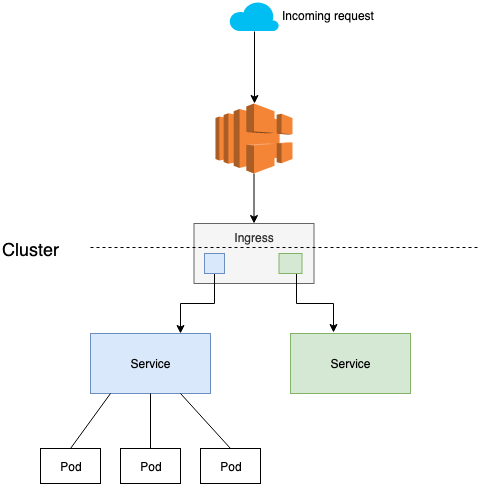

# ALB Ingress
* Source: https://github.com/kubernetes-sigs/aws-load-balancer-controller/blob/v2.2.4/docs/install/v2_2_1_full.yaml
* Documentation: https://github.com/kubernetes-sigs/aws-load-balancer-controller

## What is Ingress and Ingress Controller?
Official k8s documentation: 
* [Ingress](https://kubernetes.io/docs/concepts/services-networking/ingress/)
* [Ingress Controller](https://kubernetes.io/docs/concepts/services-networking/ingress-controllers/)
## How does it work


ALB ingress will provision an AWS Application Load Balancer automatically, it also tries to scan the TLS certificates for the domain you define in the configuration. 

ALB ingress provides a full feature of Application Load Balancer, you just need to define what you want in the configuration.

ALB Ingress annotations: https://kubernetes-sigs.github.io/aws-load-balancer-controller/v2.2/guide/ingress/annotations/

**Note**: 
* Currently, we have one main Ingress for ALB in `apps` namespace. `Ingress` kind and `Service` kind must be in the same `namespace`, this would take many AWS ALB if you have many applications in different namespaces because you need to create new Ingress for each namespace. To avoid create Ingress/ALB for each namespace, we can route the traffics from `Service` to `Service` in another namespace. (https://kubernetes.io/docs/concepts/services-networking/service/#services-without-selectors)

Example: 
```yaml
kind: Service
apiVersion: v1
metadata:
  name: service-a
  namespace: namespace-a
spec:
  type: ExternalName
  externalName: service-b.namespace-b.svc.cluster.local
  ports:
  - port: 80
```
